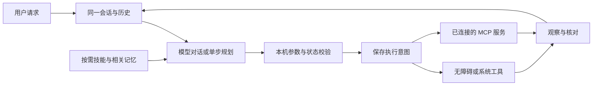

# 架构与执行语义

LifeBuddy 的执行循环位于 Android 本机。云端模型提出下一步；本机负责协议校验、工具执行、持久化、观察和结果核对。

## 核心模块

| 模块 | 职责 |
| --- | --- |
| `core/cloud` | 多轮对话、SSE 解析、工具配对、上下文预算与压缩 |
| `core/phone` | 页面与动作协议、运行器、恢复预算、完成证据与连续会话 |
| `core/learning` | 可验证任务片段、参数化技能、修订及失效管理 |
| `core/extensions` | 技能导入、分页检索、MCP 生命周期、目录和调用 |
| `app/phone` | AccessibilityService、界面树观察、Android 动作与悬浮控制 |
| `app/runtime` | 任务生命周期、暂停/停止、返回对应会话 |
| `app/data` | SQLite 历史、原子文件、加密凭据和配置 |
| `app/ui`、`app/i18n` | 对话、历史、设置、学习、扩展及中英界面 |

## 会话与上下文

完整历史和模型上下文分别维护。聊天使用滚动摘要和近期完整回合；原始记录不会随摘要删除。摘要失败时保留上一检查点。工具调用与结果保持 ID 配对，历史读取不重放执行。

手机任务的会话 ID 与每轮执行 ID 分开。用户接着说“再发一次”可引用同一会话前文，但会开始新的执行轮次并重新核对当前界面。旧节点和旧动作不会直接重放。

模型每次只规划一个步骤；页面在执行前发生变化时拒绝旧动作，并有限重规划。每次任务最多 40 个步骤槽位、10 分钟。页面、消息、技能和应用候选都有大小限制。

## 外部动作的一致性

执行意图先于外部操作持久化。持久化失败则不发出操作；发出后断线、取消或没有足够证据时，结果保持待确认。网络层不自动重试 MCP tools/call，也不跟随跳转。

消息通过专用工具核对收件人与正文后发送一次，再检查页面新增内容。这不能替代消息送达或已读回执。系统控件读回状态；纯 MCP 任务可按实际返回回答；混合手机任务仍需页面证据。

暂停和停止不回滚外部世界。再次尝试需要用户发起新一轮要求，模型不得把失败的后续观察当作“前面的操作没有发生”。

## 记忆与学习

长期记忆保存明确表达的事实或偏好，不保存内部推理。习惯候选需用户确认。自动技能来自有完成证据的操作片段：把输入替换成参数、去掉旧节点和坐标、保留可复核流程。不同参数复用成功后更新验证状态；版本变化或连续可归因失配可暂停技能。

技能正文只在相关任务加载，不能成为扩大授权的来源。自动技能、导入技能和完整任务记录独立保存。

## 数据边界

Android 私有目录存储历史与技能，Keystore 保护模型 Key 和 MCP 认证头。配置页不作为普通手机任务页面上传。云端规划会发送相关上下文、任务与当前可访问文字；MCP 服务会收到调用参数。数据发送对象由用户配置，不经过 LifeBuddy 自有后台。

当前没有屏幕视觉模型、坐标点击、日常被动录制或无人值守后台执行。可选本地模型代码不参与默认手机规划流程。
